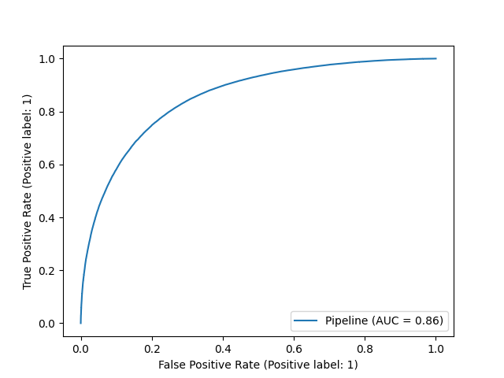
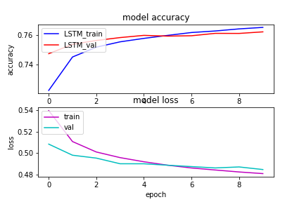
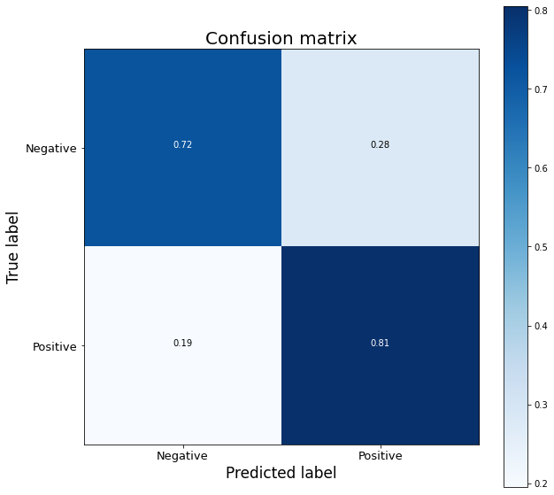

# Консольное приложение для анализа твитов пользователя

**Цель:** создать приложение для анализа твитов заданного пользователя.
Приложение должно предоставлять статистику позитивных и негативных постов
пользователя за 2021-й год.

**Обучение** моделей производилось на [данных](https://www.kaggle.com/kazanova/sentiment140).

**Этапы работы:**
1. Разработать и обучить модель на представленном датасете.
2. Создание модуля скачивания данных из twitter.
3. Создание консольное приложение.

## Обучение моделей

### Предварительная обработка данных

Для подготовки данных к обучению проводилась предварительная фильтрация:
* все твиты приводились к одному регистру
* удалений обращений к пользователям вида @username
* удаление всех ссылок из твитов
* удаление хештегов
* удаление знаков пунктуации
* удаление стоп-слов (слова не несущие особой значимости -- I, is, so etc.)
* удаление избыточных букв, повторявшихся в словах более 2 раз подряд так,
  чтобы оставались только 2 одинаковых буквы (напрмер, alll --> all)

Для этого использованы библиотеки pandas, nltk, а также работа с
регулярными выражениями (модуль re из стандартной библиотеки Python).

### Логистическая регрессия

На первом этапе строилась простая модель для бинарной классификации данных
на основе логистической регрессии.

Для этого использовалась библиотека scikit-learn.

График кривой roc-auc:



Модель на основе логистической регрессии предсказывает настроение
твитов с точностью ~0.78.

### LSTM рекуррентная нейронная сеть

Сначала планировалось обучение рекуррентной нейронной сети с использованием
предобученной нейронной сети BERT,
однако возникла проблема нехватки вычислительным мощностей, в том числе и на
Google Colab. В результате было принято решение построить LSTM,
которая является модификацией RNN.

Для построения такой нейронной сети использовались фреймворки tensorflow и keras
со следующими параметрами:
* функция активации на последнем слое - сигмоида,
  стандарт для задач бинарной классификации

* функция потерь - binary crossentropy, что также стандарт для
  задач бинарной классификации

* оптимизатор - Адам

* метрика качества - accuracy

График обучения модели:



Нейронная сеть обучалась 10 эпох. [Метрики](./model/neural_network_metrics.csv)
качества по каждой эпохе. Точность обученной нейронной сети составляет ~0.76.

Confusion matrix для обученной модели:


Таким образом, более простой вариант модели, основанной на логистической
регрессии показывает более высокую точность. Однако при обучении нейронной сети
было мало эпох из-за ограниченных вычислительных мощностей, при их увеличении,
вероятно, можно будет достичь большей точности LSMT.

## Загрузка данных из Twitter

Twitter не предоставляет открытого API, а для получения доступа,
необходимо иметь подтвержденный аккаунт разработчика. В ходе решения
данной проблемы был найден инструмент twint, который можно также использовать,
как и python модуль. Twint предоставляет широкие возможности для загрузки
твитов пользователей, в том числе и скачивание данных за определенный период.

## Консольное приложение

Консольное приложение написано с использованием argparse.
Для визуализации использованы библиотеки seaborn и termplotlib.

В приложении можно выбирать желаемый формат графиков (png или ascii), а также
модель для предсказания настроений пользователя — логистическая регрессия или
нейронная сеть.
Пользователи, для которых произведен анализ, сохраняются в базе в директории `users_base`
в соответствующей подпапке.
Графики в формате png для удобного сохранения в базе рисуются всегда автоматически,
также возможно вывести графики в виде ascii символов в консоли
(и они также сохранятся в текстовый файл в директории пользователя)
при выборе соответствующей опции.

В результате работы приложения для каждого пользователя создается 2 графика:
* общий анализ настроения всех твитов за 2021 год
* анализ настроения твитов по месяцам

Доступные аргументы:
```bash
-u, --username      Имя пользователя в twitter, для которого необходимо провести анализ
                    настроения твитов

-p, --plot          Формат графиков - ascii или png (по умолчанию)

-m, --model         Выбор модели для предсказания настроения твитов пользователя.
                    glm - логистическая регрессия (по умолчанию)
                    nn - нейронная сеть

-l, --users_list    Вывод пользователей, для которых уже есть результаты анализа в базе
                    True или False (по умолчанию)
```

Пример команды

```bash
python3 tweets_analyzer.py -u google -p png -l True -m nn
```

## Зависимости

Установка зависимостей:

```bash
pip install -r requirements.txt
```

Для установки twint:
```bash
pip install --user --upgrade git+https://github.com/twintproject/twint.git@origin/master#egg=twint
```

**_NB!_** Перед использованием приложения распаковать файл
с моделью нейронной сети для предсказаний `/model/best_model.zip`
